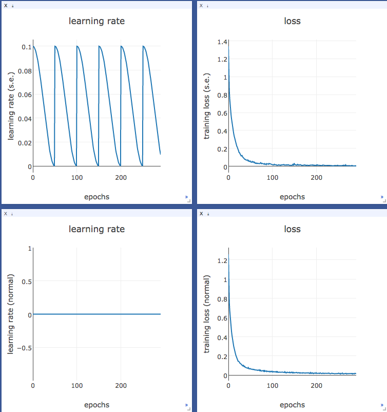

PyTorch implementation of [SNAPSHOT ENSEMBLES: TRAIN 1, GET M FOR FREE](https://arxiv.org/abs/1704.00109)

`basic.py` is simple network for CIFAR10 classification. A result is shown below: accuracy is 72% for the proposed training method while 75% for normal training method.

